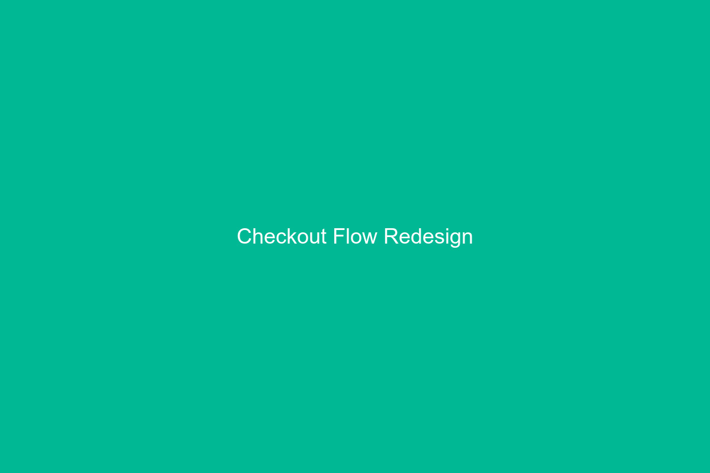

---
# ============================================================
# Case Study: Blockdaemon Nodes Checkout Redesign
# ============================================================
title: "Nodes Checkout Redesign"
company: "Blockdaemon"
role: "Senior Product Designer"
industry: "Blockchain / Web3"
description: "Simplifying the node deployment checkout flow to reduce drop-off and increase conversion."
heroImage: "./images/bd-checkout-hero.jpg"
thumbnail: "./images/bd-checkout-thumb.jpg"
thumbnailAlt: "Screenshot of the Blockdaemon checkout flow"
employer: "blockdaemon"
sortOrder: 2
draft: false
metrics:
  - label: "Checkout drop-off"
    value: "-40%"
  - label: "Time to deploy"
    value: "3 min"
  - label: "Enterprise deals"
    value: "+25%"
---

import FullBleedImage from "../../components/mdx/FullBleedImage.astro";
import Callout from "../../components/mdx/Callout.astro";

import checkoutFlow from "./images/bd-checkout-flow.jpg";
import dashboardFullBleed from "./images/bd-checkout-fullbleed.jpg";

## The Challenge

Blockdaemon's node deployment marketplace allowed enterprises to spin up
blockchain infrastructure in minutes — but the checkout flow was losing
40% of users before completion.

The existing flow was designed for crypto-native engineers, but the
customer base had shifted toward enterprise IT teams who needed a more
familiar purchasing experience.

<Callout label="Business Context">
  Each lost checkout represented an average contract value of $15K/year.
  Reducing drop-off by even 10% would have a significant revenue impact.
</Callout>

## Research

I partnered with the sales team to shadow 10 enterprise demos and interviewed
8 customers who had abandoned checkout. The pain points were clear:

- **Jargon overload** — terms like "staking rewards" and "consensus client" confused
  IT procurement teams
- **Pricing opacity** — costs weren't visible until the final step
- **Too many choices** — users had to configure 12+ options before deploying

## Design Approach

I redesigned the checkout as a **progressive disclosure flow** with three key principles:

1. **Smart defaults** — pre-configure the most common options based on the user's plan
2. **Upfront pricing** — show running cost estimates at every step
3. **Plain language** — translate blockchain jargon into familiar infrastructure terms

## Full Dashboard View

<FullBleedImage
  src={dashboardFullBleed}
  alt="The complete Blockdaemon nodes dashboard"
  caption="The nodes management dashboard after checkout, showing deployment status."
/>

## Results

After a phased rollout over 4 weeks:

- **Checkout drop-off decreased by 40%** — from 40% to 24%
- **Average time to deploy a node** went from 12 minutes to 3 minutes
- **Enterprise deal close rate** improved by 25%
- **Support tickets** about deployment decreased by 50%

The checkout redesign became a key talking point in Blockdaemon's enterprise
sales pitch and was featured in the company's Series C investor materials.
